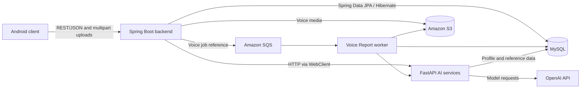

# I:ON


I:ON is an AI-assisted parenting-education application for prospective parents and caregivers of children up to age seven. It connects guided learning, conversation feedback, and contextual parenting support in one Android experience.

## Overview

I:ON addresses three practical gaps in parenting education: limited access to structured guidance, difficulty applying theory in everyday situations, and a lack of advice tailored to a family's context.

The application organizes support as **Learn → Practice → Consult**. Parents work through personalized learning material, reflect on recorded interactions, and ask follow-up questions with relevant profile and reference context.

## Key Features

### Workbook — Learn

- Generates parenting-learning content using child, family, and parenting-profile information.
- Combines child-development theory with written and multiple-choice activities.
- Adds scenario-based parent-child conversation practice and feedback.

### Voice Report — Practice

- Processes uploaded parent-child conversation recordings with speech-to-text and speaker separation.
- Analyzes interaction patterns, emotional expression, and speaking balance.
- Produces behavioral feedback and alternative wording or response suggestions.

### Parenting Chatbot — Consult

- Uses profile information and conversation history to maintain context.
- Retrieves relevant parenting reference material before generating a response.
- Supports follow-up questions outside the guided workbook flow.

Onboarding, the parenting-style questionnaire, home summaries, progress, rewards, and profile management support these three core features.

## Demo

A demo of the original team project is available in the public [demo video](https://github.com/kylasson/ION/releases/tag/demo).

## Architecture



The Android client calls backend REST endpoints through Retrofit and OkHttp. The backend owns application request handling and persistence, and delegates workbook generation, workbook feedback, chatbot responses, and voice analysis to separate Python services. 

## System Components

- [**Android application**](android/README.md) — presents onboarding, workbook, voice-report, chatbot, home, and profile flows.
- [**Backend server**](backend/README.md) — exposes the application REST API, manages persistence, and coordinates calls to AI services.
- [**AI services**](ai/README.md) — provide workbook generation and feedback, conversation analysis, and retrieval-assisted chatbot responses.

## Repository Structure

- `android/` — Kotlin Android client built with Jetpack Compose and a layered presentation/domain/data structure.
- `backend/` — Java Spring Boot REST application, domain services, and persistence layer.
- `ai/` — Python FastAPI services for workbook generation and feedback, chatbot responses, and voice-report analysis.
- `perf/` — independent post-project JPA/MySQL performance study of Workbook repository queries.

## Tech Stack

- **Client:** Kotlin, Jetpack Compose, Hilt, Retrofit, OkHttp, DataStore, Kotlin Serialization
- **Backend:** Java 21, Spring Boot 3, Spring Data JPA, Hibernate, Spring WebClient
- **Data:** MySQL
- **AI:** Python, FastAPI, OpenAI API, PyMySQL, sentence-transformers, NumPy
- **Build & Tooling:** Gradle
- **Performance Study:** MySQL 8, shell/Python automation, C MySQL client benchmark runner

## Getting Started

Prerequisites:

- **Android:** Android Studio, Android SDK 35, and JDK 17
- **Backend:** Java 21 and MySQL 8
- **AI services:** Python 3

Basic entry points from the repository root:

```bash
# Android debug build
cd android
./gradlew assembleDebug

# Backend
cd ../backend
./gradlew bootRun
```

See the [Android](android/README.md), [backend](backend/README.md), and [AI](ai/README.md) documentation for component-specific setup. Local credentials and service endpoints must be supplied outside Git. The original hosted services are offline, so complete end-to-end execution requires replacement endpoints.

## Performance Extension

After the team project, I independently studied the backend's Spring Data JPA and MySQL access patterns using deterministic, reconstructed local datasets of up to approximately 500K rows. A composite index aligned with the Workbook lookup patterns reduced median JPA repository latency by approximately 15–20%; the saved execution plans also show fewer index rows read and removal of filesorts.

This was a reconstructed local benchmark, not a production-database measurement. See the [performance study](perf/README.md) for methodology, detailed results, execution plans, and limitations.

The repository also includes an independent [asynchronous Voice Report extension](docs/async-voice-pipeline.md): original media is stored in S3, a minimal SQS message triggers the existing analysis path, persisted job state supports Android polling, and stale processing leases provide recovery for at-least-once delivery. Its deterministic local benchmark measures request acceptance decoupling, not faster AI inference or production AWS latency.

## Project Context

I:ON began as a team capstone project. I contributed to application architecture, AWS deployment design, cross-component integration, and Android development.

The `team-project-final` tag marks the end of the original team-project state. The original repository is available at [kylasson/ION-Team](https://github.com/kylasson/ION-Team).

## Documentation

- [Android client](android/README.md)
- [Backend](backend/README.md)
- [AI services](ai/README.md)
- [Performance study](perf/README.md)
- [Asynchronous Voice Report pipeline](docs/async-voice-pipeline.md)
